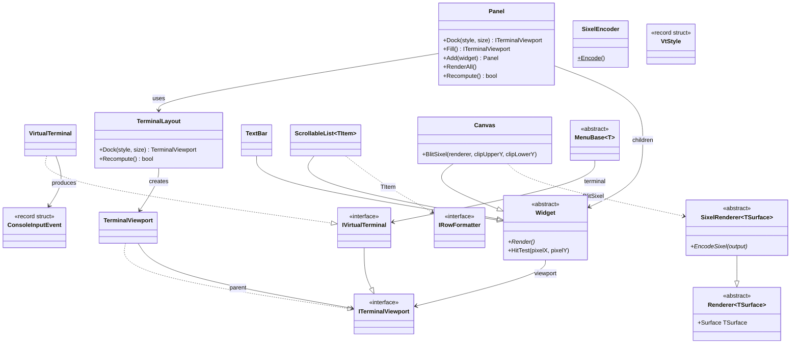

# Console.Lib

A .NET library for building terminal applications with dock-based layouts, widgets, mouse/keyboard input, VT styling, and Sixel graphics rendering. AOT-compatible, targeting .NET 10.

## Architecture overview



## Terminal abstraction

### ITerminalViewport

The core output interface. Represents a rectangular region that supports cursor positioning, text output, and stream access:

```csharp
public interface ITerminalViewport
{
    (int Column, int Row) Offset { get; }
    (int Width, int Height) Size { get; }
    void SetCursorPosition(int left, int top);
    void Write(string text);
    void WriteLine(string? text = null);
    TermCell CellSize { get; }
    (uint Width, uint Height) PixelSize { get; } // default: Size * CellSize
    void Flush();
    Stream OutputStream { get; }
}
```

`TermCell` holds the pixel dimensions of a single terminal character cell, queried from the terminal during initialization via the `\e[16t` control sequence.

### IVirtualTerminal

Extends `ITerminalViewport` with full terminal lifecycle: initialization, input reading, alternate screen buffer, and Sixel capability detection.

```csharp
public interface IVirtualTerminal : ITerminalViewport, IAsyncDisposable
{
    Task InitAsync();
    bool HasSixelSupport { get; }
    void EnterAlternateScreen();
    bool IsAlternateScreen { get; }
    void Clear();
    bool HasInput();
    ConsoleInputEvent TryReadInput();
}
```

`VirtualTerminal` is the concrete implementation backed by `System.Console`. On initialization it:

1. Sets UTF-8 encoding for stdin/stdout
2. Sends a Device Attributes request (`\e[0c`) to detect terminal capabilities (including Sixel support)
3. Sends a cell size query (`\e[16t`) to determine pixel dimensions per character cell
4. On Windows, enables virtual terminal I/O and mouse input via `WindowsConsoleInput`

When entering the alternate screen, it enables VT200 mouse tracking with SGR extended coordinates (`\e[?1000h`, `\e[?1006h`), parses SGR mouse events from raw stdin, and normalizes cell coordinates to pixel coordinates using the cell size.

### TerminalViewport

A sub-region of a parent viewport. Translates local coordinates to parent coordinates by adding column/row offsets. Clamps cursor positions to stay within bounds. Viewports can be nested — offsets compose through the parent chain.

```csharp
var terminal = new VirtualTerminal();
// Create a 30x15 viewport starting at column 10, row 5
var viewport = new TerminalViewport(terminal, 10, 5, 30, 15);
viewport.SetCursorPosition(0, 0); // → terminal position (10, 5)
viewport.SetCursorPosition(3, 7); // → terminal position (13, 12)
```

## Layout system

### DockStyle

```csharp
public enum DockStyle { Top, Bottom, Left, Right, Fill }
```

### TerminalLayout

Computes viewport geometries using a dock-based algorithm. Edge-docked panels are allocated first in registration order, each consuming space from the remaining rectangle. The `Fill` panel receives whatever space remains.

```csharp
var layout = new TerminalLayout(terminal);
var statusBar = layout.Dock(DockStyle.Bottom, 1);  // 1 row at bottom
var sidebar   = layout.Dock(DockStyle.Right, 24);  // 24 columns on right
var main      = layout.Dock(DockStyle.Fill);        // remainder
```

For an 80x24 terminal, this produces:
- `statusBar`: 80x1 at (0, 23)
- `sidebar`: 24x23 at (56, 0)
- `main`: 56x23 at (0, 0)

`Recompute()` recalculates all geometries after a terminal resize, returning `true` if the size actually changed.

### Panel

Higher-level container that wraps `TerminalLayout` and manages a collection of widgets:

```csharp
var panel = new Panel(terminal);

var statusBar = new TextBar(panel.Dock(DockStyle.Bottom, 1));
var history   = new ScrollableList<MyRow>(panel.Dock(DockStyle.Right, 24));
var canvas    = new Canvas(panel.Fill());

panel.Add(statusBar).Add(history).Add(canvas);
panel.RenderAll(); // renders all widgets
```

The two-step pattern (dock creates the viewport, then pass it to a widget constructor) keeps viewport ownership clear — each widget owns exactly one viewport from construction.

## Widgets

All widgets inherit from `Widget`, which provides:

- **`Viewport`** — the `ITerminalViewport` this widget renders to
- **`Render()`** — abstract method to draw the widget's current state
- **`HitTest(pixelX, pixelY)`** — converts absolute pixel coordinates to viewport-local cell coordinates, returning `null` if outside bounds

### TextBar

Single-line status bar with left-aligned and right-aligned text, styled with `VtStyle`:

```csharp
var bar = new TextBar(viewport);
bar.Text(" Ready")
   .RightText("12.3ms ")
   .Style(new VtStyle(SgrColor.BrightWhite, SgrColor.BrightBlack))
   .Render();
```

### ScrollableList\<TItem\>

Multi-row scrollable list with an optional header. Items must implement `IRowFormatter`:

```csharp
public interface IRowFormatter
{
    string FormatRow(int width);
}
```

Each item produces its own styled row string (including VT escape codes and padding to full width). The list handles scrolling and empty-row rendering:

```csharp
var list = new ScrollableList<MyRow>(viewport)
    .Header(" Items")
    .HeaderStyle(new VtStyle(SgrColor.BrightWhite, SgrColor.BrightBlack))
    .Items(rows)
    .ScrollTo(startOffset)
    .Render();

int visibleRows = list.VisibleRows; // data rows (excludes header)
```

### Canvas

A viewport widget for custom rendering, typically Sixel graphics. Exposes the viewport's pixel dimensions and output stream:

```csharp
var canvas = new Canvas(viewport);
var (pixelW, pixelH) = canvas.PixelSize;
canvas.SetCursorPosition(0, 0);
// write directly to canvas.OutputStream
```

#### BlitSixel

`Canvas.BlitSixel` handles the complete Sixel output pipeline — cursor positioning, full vs partial rendering, and cell-height-aligned clipping:

```csharp
canvas.BlitSixel(renderer, clipUpperY, clipLowerY);
```

For a full blit (clip spans the entire render height), it positions the cursor at (0, 0) and calls `renderer.EncodeSixel(stream)`. For a partial blit, it aligns the clip region to cell-height boundaries (since Sixel output must start at a character row) and calls `renderer.EncodeSixel(startY, cropHeight, stream)`. This alignment avoids visual tearing from mid-cell Sixel writes.

## Sixel graphics

### SixelRenderer\<TSurface\>

Abstract class extending `Renderer<TSurface>` (from DIR.Lib) with Sixel encoding:

```csharp
public abstract class SixelRenderer<TSurface>(TSurface surface) : Renderer<TSurface>(surface)
{
    public abstract void EncodeSixel(Stream output);
    public abstract void EncodeSixel(int startY, uint height, Stream output);
}
```

Concrete implementations (e.g., `MagickImageRenderer` in Chess.ImageMagick) provide the actual pixel-to-Sixel encoding by extracting raw pixel data and passing it to `SixelEncoder`.

### SixelEncoder

High-performance encoder that converts raw pixel arrays to the Sixel terminal graphics format. Key design decisions:

- **Frequency-based palette**: When more than 256 unique colors exist, the most frequent colors get exact palette slots (preserving large solid areas like board tiles). Remaining colors map to their nearest palette entry.
- **Precomputed sixel grid**: A single row-major pass builds sixel bits for all colors simultaneously, then each color encodes from a contiguous memory slice. This is cache-friendly and avoids the naive O(colors × rows × width) approach.
- **ArrayPool allocation**: All large buffers (index map, sixel grid, palette, output buffer) are rented from `ArrayPool<byte>.Shared`, eliminating GC pressure from repeated allocations.
- **Partial encoding**: Supports vertical slicing without image cloning — just pass a `startY` offset and height.

Performance vs ImageMagick's built-in Sixel writer:

| Scenario | ImageMagick | SixelEncoder | Speedup |
|----------|-------------|--------------|---------|
| Full     | 127.3 ms    | 9.1 ms       | 14×     |
| Partial  | 127.9 ms    | 1.6 ms       | 79×     |

## Styling

### VtStyle and SgrColor

Typed replacement for raw VT escape code strings:

```csharp
public enum SgrColor : byte
{
    Black, Red, Green, Yellow, Blue, Magenta, Cyan, White,
    BrightBlack, BrightRed, BrightGreen, BrightYellow,
    BrightBlue, BrightMagenta, BrightCyan, BrightWhite,
}

public readonly record struct VtStyle(SgrColor Foreground, SgrColor Background)
{
    public const string Reset = "\e[0m";
    public override string ToString() => $"\e[{FgCode};{BgCode}m";
}
```

Use directly in string interpolation — the implicit `ToString()` emits the SGR escape sequence:

```csharp
var style = new VtStyle(SgrColor.BrightYellow, SgrColor.Blue);
terminal.Write($"{style}Highlighted text{VtStyle.Reset}");
// produces: \e[93;44mHighlighted text\e[0m
```

## Input handling

### ConsoleInputEvent

A unified input event that may contain a mouse event, a key press, or both:

```csharp
public readonly record struct ConsoleInputEvent(MouseEvent? Mouse, ConsoleKey Key, ConsoleModifiers Modifiers);
public readonly record struct MouseEvent(int Button, int X, int Y, bool IsRelease);
```

Mouse coordinates are in pixels (normalized using `TermCell` dimensions). Button encoding follows the X11/SGR convention: 0 = left, 1 = middle, 2 = right, 64/65 = scroll up/down.

`VirtualTerminal.TryReadInput()` parses SGR mouse sequences (`\e[<Pb;Px;Py M/m`) in alternate screen mode, and falls back to `Console.ReadKey` in normal mode. It also parses CSI sequences for arrow keys, function keys, Home/End, Delete, PageUp/PageDown, and SS3 sequences for F1-F4.

## Menus

### MenuBase\<T\>

Abstract base for fullscreen menus with arrow-key navigation, digit shortcuts, and mouse click support. In alternate screen mode, renders a centered menu with resize handling. In normal mode, falls back to a simple numbered list.

```csharp
public class MyMenu(IVirtualTerminal terminal, TimeProvider timeProvider)
    : MenuBase<string>(terminal, timeProvider)
{
    protected override async Task<string> ShowAsyncCore(CancellationToken ct)
    {
        var choice = await ShowMenuAsync("Title", "Pick one:", ["A", "B", "C"], ct);
        return choice switch { 0 => "A", 1 => "B", _ => "C" };
    }
}
```

## Platform support

- **Windows**: `WindowsConsoleInput` enables virtual terminal I/O and mouse tracking via Win32 `SetConsoleMode`. Restores original console mode on dispose.
- **Unix/macOS**: VT100 escape sequences work natively. Mouse tracking uses the same SGR extended format.

## Terminal capability detection

During `InitAsync()`, `VirtualTerminal` sends a Primary Device Attributes request (`\e[0c`). The response contains capability codes parsed into the `TerminalCapability` enum:

| Code | Capability |
|------|-----------|
| 4    | Sixel graphics |
| 22   | Color |
| 18   | Windowing |
| 1    | 132 columns |

Unknown capability codes are silently ignored.
