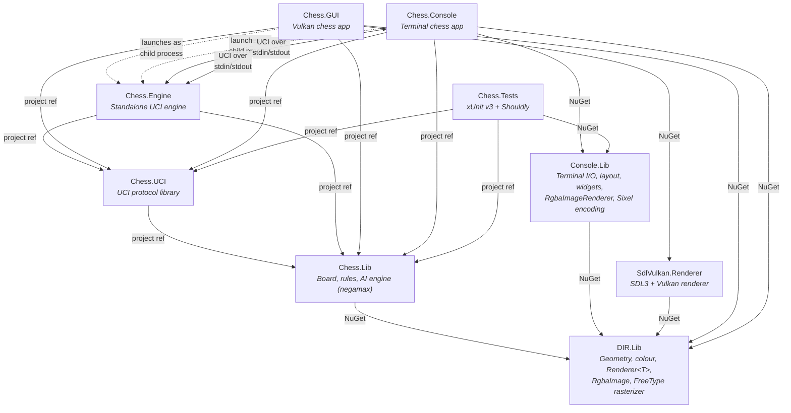

# Chess

A chess game with terminal (Sixel) and Vulkan GUI rendering backends, built in C# on .NET 10.


## Features

- Full chess rules: movement, captures, check, checkmate, stalemate, pawn promotion
- Player vs Player, Player vs Computer, and Custom Game (board editor) modes
- [UCI](https://en.wikipedia.org/wiki/Universal_Chess_Interface) protocol support — the engine runs as a separate process, communicating via standard UCI commands
- **Terminal app**: graphical board rendered using FreeType2 and the [Sixel](https://en.wikipedia.org/wiki/Sixel) protocol (no ImageMagick dependency)
- **Vulkan GUI app**: standalone windowed app using SDL3 + Vortice.Vulkan
- Move history panel with algebraic notation — click any move or use Ctrl+Arrow to review past positions
- Cross-platform: Windows, Linux, and macOS (x64 and ARM64)
- Native AOT compiled for fast startup and small footprint

## Requirements

- A terminal with [Sixel](https://en.wikipedia.org/wiki/Sixel) support (e.g. Windows Terminal, mlterm, foot, WezTerm) is preferred for the console app; there is an ASCII-only fallback
- Vulkan-capable GPU for the GUI app
- .NET 10 SDK (to build from source)

## Getting started

### Download a release

Pre-built binaries are available on the [Releases](https://github.com/sebgod/chess/releases) page for:

| Platform | Console | GUI |
|---|---|---|
| Windows x64 | `chess-console-win-x64.tar.gz` | `chess-gui-win-x64.tar.gz` |
| Windows ARM64 | `chess-console-win-arm64.tar.gz` | `chess-gui-win-arm64.tar.gz` |
| Linux x64 | `chess-console-linux-x64.tar.gz` | `chess-gui-linux-x64.tar.gz` |
| Linux ARM64 | `chess-console-linux-arm64.tar.gz` | `chess-gui-linux-arm64.tar.gz` |
| macOS ARM64 | `chess-console-osx-arm64.tar.gz` | `chess-gui-osx-arm64.tar.gz` |
| macOS x64 | `chess-console-osx-x64.tar.gz` | `chess-gui-osx-x64.tar.gz` |

### Build from source

```bash
git clone https://github.com/sebgod/chess.git
cd chess
dotnet build -c Release
dotnet run --project Chess.Console -c Release   # Terminal app
dotnet run --project Chess.GUI -c Release        # Vulkan GUI app
```

## Running tests

```bash
dotnet test -c Release
```

## Keyboard controls

### Gameplay

| Key | Action |
|-----|--------|
| `a`–`h` | Select file (column) |
| `1`–`8` | Select rank (row) — combines with pending file to select a square |
| `Esc` | Clear current selection |
| `F1` | Toggle help |

Select a piece by typing its file + rank (e.g. `e2`), then type the target square (e.g. `e4`) to move. When a piece is already selected, typing just a rank moves it along the same file.

### Playback

During a game, you can review past positions by navigating the move history. Click a move in the history panel, or use:

| Key | Action |
|-----|--------|
| `Ctrl+Left` / `Ctrl+Right` | Step back / forward by one ply |
| `Ctrl+Up` / `Ctrl+Down` | Step back / forward by one full move |
| `Esc` | Exit playback and return to the game |

### Promotion popup

When a pawn reaches the last rank, a popup appears with four piece choices. Click the desired piece, or use:

| Key | Piece |
|-----|-------|
| `n` | Knight |
| `b` | Bishop |
| `r` | Rook |
| `q` | Queen |

### Custom Game setup

In Custom Game mode, you place pieces on the board before playing. The popup appears above the selected square.

| Key | Action |
|-----|--------|
| `a`–`h` + `1`–`8` | Select a square to place a piece on |
| `p` | Place Pawn |
| `n` | Place Knight |
| `b` | Place Bishop |
| `r` | Place Rook |
| `q` | Place Queen |
| `k` | Place King |
| `Tab` | Toggle between placing White and Black pieces |
| `Delete` / `Backspace` | Clear the selected square |
| `Esc` | Cancel the piece popup |
| `s` | Finish setup and start the game |

### Menus

| Key | Action |
|-----|--------|
| `Up` / `Down` | Navigate menu items |
| `Enter` | Confirm selection |
| `1`–`3` | Quick-select by number |

## Project structure

| Project | Description |
|---|---|
| `Chess.Lib` | Core chess library: board, pieces, rules, AI engine (negamax with alpha-beta pruning) |
| `Chess.UCI` | Shared UCI protocol library (parsing, formatting, client/server) |
| `Chess.Engine` | Standalone UCI engine executable (`chess-engine`), supports `go depth N` |
| `Chess.GUI` | Vulkan chess app (SDL3 + Vortice.Vulkan windowing/rendering) |
| `Chess.Console` | Terminal chess app with Sixel and ASCII display backends |
| `Chess.Tests` | xUnit v3 test suite |

### NuGet library dependencies

| Package | Description |
|---|---|
| [DIR.Lib](https://github.com/SharpAstro/DIR.Lib) | Device-independent rendering: geometry, colour, abstract `Renderer<T>`, `RgbaImage`, `FreeTypeGlyphRasterizer` |
| [Console.Lib](https://github.com/SharpAstro/Console.Lib) | Terminal I/O, dock-based layout, widgets, `RgbaImageRenderer`, Sixel encoding, truecolor/SGR-16 styling |
| [SdlVulkan.Renderer](https://github.com/SharpAstro/SdlVulkan.Renderer) | SDL3 + Vortice.Vulkan renderer: `VkRenderer`, `VulkanContext`, `VkFontAtlas` |

### Architecture


