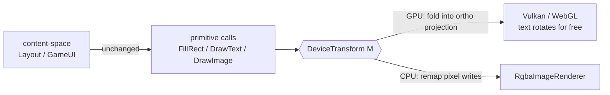

# Design: a constrained content→device transform (DPI + rotation, unified)

**Status:** Phases 1a (Vulkan) and 2 (chess consumer) are **done** (see [Phasing](#phasing)); the
WebGL compose (1b) and the CPU backend (3) are still pending. **Repo scope:** this describes a change to the
**sibling rendering libraries** (`DIR.Lib` + its backends `SdlVulkan.Renderer`, `WebGl.Renderer`,
and the CPU `RgbaImageRenderer`); chess is only a *consumer*. It lives here because chess is the
driver use case (the [Android across-the-table hot-seat](../Chess.Droid/docs/tablet-hotseat-flip.md)),
but it can't be implemented in this repo — the sibling libs must ship the capability first.

## Why

Three things in the rendering stack are really the same thing wearing different clothes:

- **DPI scaling** — currently a scalar `dpiScale` threaded by hand through the pipeline
  (`ListScrollController.SetExtent(dpiScale)`, `VkFontAtlas`, and — as of DIR.Lib 6.15 —
  `PixelWidgetBase.DpiScale`).
- **Device/screen rotation** — today delegated to the Vulkan compositor via `preTransform`
  (`VulkanContext` prefers `Identity` and lets the presentation engine rotate).
- **The hot-seat 180° flip** — an *app-driven* rotation of the whole composited frame so the player
  across a flat tablet reads everything (text included) upright.

Each is an affine map from content coordinates to device pixels. DPI is the **scale** component;
rotation is the **rotation** component; safe-area/letterbox offset is the **translation** component.
Modelling them separately is why `dpiScale` is a lonely scalar and why the hot-seat looks like it needs
bespoke renderer surgery. Model them as **one transform** and they collapse into a single concept.

## The primitive

A **content→device transform** `M`, deliberately *constrained*:

- rotation ∈ **{0°, 90°, 180°, 270°}** only,
- **uniform** scale (no anisotropy),
- **no shear**,
- plus a translation.

Represent it as a constrained struct, **not** a raw 2×3 matrix, so the invariant is enforced by
construction (shear/anisotropy are unrepresentable):

```csharp
public readonly record struct DeviceTransform(Rotation90 Rotation, float Scale, float Tx, float Ty)
{
    public static readonly DeviceTransform Identity = new(Rotation90.None, 1f, 0f, 0f);
    public bool IsIdentity { get; }
    public Matrix3x2 ToMatrix3x2();          // canonical matrix form — a 2D affine, NOT 4×4
    public Vector2 Apply(Vector2 content);   // content → device (Vector2.Transform via ToMatrix3x2)
    public Vector2 Invert(Vector2 device);   // device → content (trivial: Rᵀ · (p−t) / scale)
    public DeviceTransform Compose(DeviceTransform inner);
    // rotation about a surface centre — how a consumer builds the hot-seat 180°:
    public static DeviceTransform CenteredRotation(Rotation90 rotation, float w, float h, float scale = 1f);
}

// backed int = clockwise quarter-turns (screen space, Y-down), so composition is a mod-4 add
public enum Rotation90 { None = 0, Cw90 = 1, Half = 2, Cw270 = 3 }
```

The matrix form is **2×3** (`Matrix3x2`), not 4×4: an affine map with no perspective and no z *is* its six
coefficients, so the actual compose — `M · projection` — stays a `Matrix3x2` multiply (both operands are
2D affines: the projection is just screen→NDC scale + translate). Only at the GPU boundary is the result
widened into the `mat4` the vertex shader multiplies (`gl_Position = proj * vec4(pos, 0, 1)`) — six real
floats placed into the mat4 slots plus the two z/w constants. A 4×4 multiply would waste half its lanes.

`DpiScale` becomes a derived accessor (`DpiScale => transform.Scale`), not an independent field.

### Why the constraints are load-bearing

They are not convenience simplifications — each one keeps a large existing system valid:

1. **Rect → rect.** A 90°-multiple rotation + uniform scale maps an axis-aligned rectangle to an
   axis-aligned rectangle (width/height swap at 90°/270°). So the entire `RectInt`-based `Layout`
   tree, hit-testing, and clip rectangles stay correct **unchanged** — no general polygon
   rasterization, no clipping rework. Chess's `GameUI`/`PixelGameDisplay` keep laying out in *content*
   space; only the renderer's projection and one input mapping learn about `M`.
2. **Trivially invertible.** Input is `M.Invert(pointer)`, applied once at the host boundary, so draw
   and hit-test cannot drift. This is the whole-frame generalization of the `DisplayCell`/`LogicalCell`
   pair that already keeps the board flip consistent (`GameUI.cs`) — and it could eventually subsume
   `FlipBoard` itself.
3. **Text stays legible.** Uniform scale + no shear keeps SDF/glyph-atlas sampling clean; 90° steps
   keep glyph quads on the pixel grid.

## Draw side



- **GPU backends (Vulkan, WebGL)** get this nearly for free: compose `M` into the existing orthographic
  projection. Because `DrawText` emits glyph **quads through that same projection**, text rotates with
  everything else — so **no per-call angle parameter on `DrawText`/`DrawImage` is needed**. (An
  earlier objection — "the abstract `Renderer<TSurface>.DrawText` has no rotation argument" — only bites
  for *per-primitive* rotation. A *global* transform sidesteps it.)
- **CPU backend** (`RgbaImageRenderer`, used by Chess.Web's fallback and the console) must remap pixel
  writes explicitly. **180° is trivial** (axis negation). **90°/270° is the hard case** (axis swap +
  glyph orientation) and should be a later phase.

## Input side

The host maps each pointer event through `M.Invert(...)` before dispatch — one place, at the SDL/DOM
boundary. Everything downstream (`GameUI.FindSelected`, history hit-testing, the new
`ListScrollController`) continues to work in content coordinates.

## Safe-area insets under rotation

The safe-area cutout is physically fixed, but a rotated frame flips which *logical* edge it sits on.
Systematize the doc's old open question: **transform the safe-area inset rectangle by `M`** and set the
result on `PixelGameDisplay.SafeAreaInsets`. Under 180° that swaps top↔bottom and left↔right; under
90°/270° it cycles. No special-casing.

## Two decisions (settled)

1. **Content transform, not device transform.** `M` is an *app-driven content* transform layered **on
   top of** the compositor's surface orientation (Vulkan `preTransform`, currently `Identity`). Device/
   screen rotation stays the compositor's job exactly as today; `M` carries DPI-scale × app-rotation
   (the 180° hot-seat). Making `M` *replace* `preTransform` would mean rendering pre-rotated on every
   device turn and owning orientation correctness — more invasive, rejected.
2. **Unify DPI incrementally.** Introduce `DeviceTransform` **alongside** the existing `dpiScale`
   (`DpiScale => transform.Scale`) first; retire the scalar second (it touches every consumer —
   `VkFontAtlas`, `ListScrollController.SetExtent`, `PixelWidgetBase.DpiScale`, …).

## Phasing

| Phase | Scope | Where | Status |
|---|---|---|---|
| 1a | `DeviceTransform` type (+ `Matrix3x2`/`Vector2` algebra, unit tests) + Vulkan projection compose; all four 90° rotations work on the GPU | DIR.Lib + SdlVulkan.Renderer | **Done** — 180° flip verified via offscreen render + readback |
| 1b | WebGL projection compose (the `uProj` `mat4` is built JS-side, so this composes there or pushes the full matrix from .NET) | WebGl.Renderer | Pending |
| 2 | Host input inverse-mapping (`M.Invert`) + safe-area inset transform; wire the hot-seat 180° in Chess.Droid PvP | chess (consumer) | **Done** — `DeviceContentMapping` (Chess.Lib.UI) maps insets/cutout; taps inverted at both SDL hosts; Chess.Droid auto-flips hot-seat PvP to face the side to move (≥500dp smallest-width tablet gate) |
| 3 | CPU backend `RgbaImageRenderer` remap (180° then 90°/270°); retire the scalar `dpiScale`; consider subsuming `FlipBoard` | DIR.Lib + backends | Pending |

Note on the "180° only" original scope: on a GPU backend the rotation folds into the projection, so all
four quarter-turns render correctly for free — the 180° constraint is really about what is *wired and
verified* end-to-end (the hot-seat), not a GPU-side limitation. The CPU backend (phase 3) is where
90°/270° is genuinely harder (axis swap + glyph orientation), so it stays gated there.

## How chess consumes it (phases 1a + 2, landed)

- Chess.Droid hot-seat PvP sets `renderer.DeviceTransform = DeviceTransform.CenteredRotation(Rotation90.Half, w, h)`
  whenever Black is to move (identity on White's turn; recomputed on resize), so the whole frame —
  board, history, status, text — faces the player to move. Gated to plain PvP on tablets
  (smallestScreenWidthDp ≥ 500 — 8" tablets report ~533dp and qualify; phones stay under): vs-AI and
  LAN have a single local side and keep the identity
  transform, and the board-only `GameUI.FlipBoard` stays off in hot-seat mode (the frame rotates
  instead). The committed live side drives the flip, so playback scrubbing never spins the frame.
- `MainActivity` maps tap coordinates through `M.Invert` at the SDL boundary; Chess.GUI's unified
  `OnPointerInput` does the same (identity on the desktop today — correct by construction).
- Safe-area insets and the camera cutout come from the OS in device space and are mapped into content
  space by `DeviceContentMapping` (Chess.Lib.UI): insets permute edges (180° swaps top↔bottom,
  left↔right), the cutout rect inverts its corners. `PixelGameDisplay` layout is unchanged.
